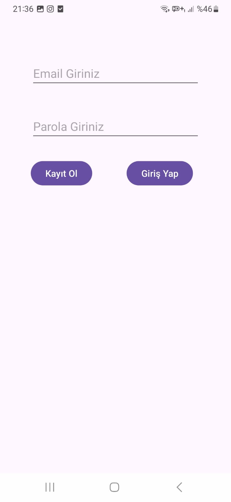
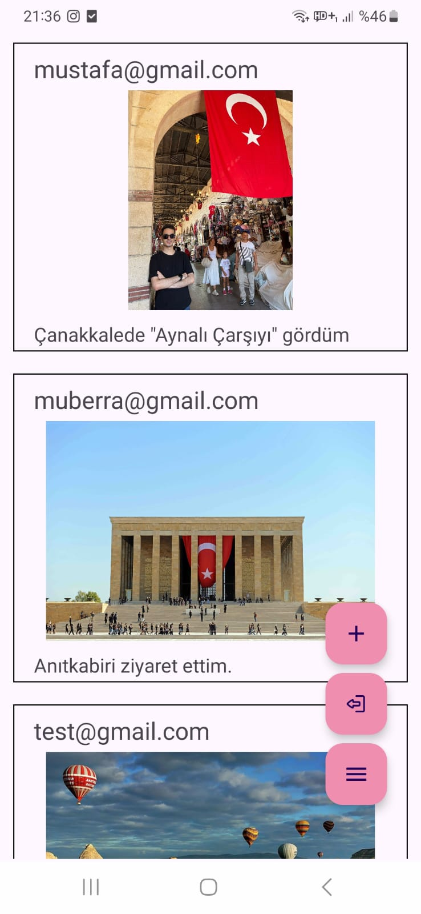
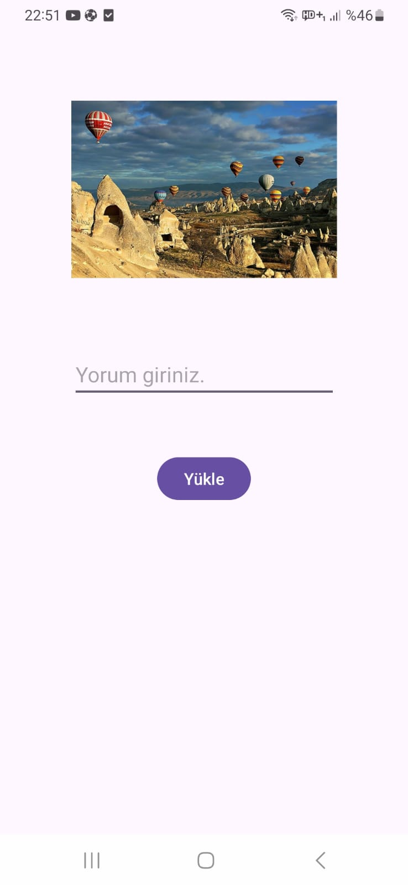

# 📸 Fotoğraf Paylaşma Uygulaması

Bu proje, kullanıcıların e-posta ile kayıt olup giriş yapabildiği, fotoğraf seçip açıklama ekleyerek paylaşım yapabildiği basit bir sosyal medya tarzı Android uygulamasıdır.  
Veriler **Firebase Firestore** üzerinde, görseller ise **Base64 formatında** saklanır.  

---

## 🚀 Özellikler

- 🔐 **Firebase Authentication** ile e-posta & parola tabanlı giriş/kayıt sistemi  
- 🧠 **Firebase Firestore** ile veri saklama  
- 🖼️ Görsellerin **Base64 formatında Firestore’da saklanması**  
- 🕒 Gönderilerin tarih sırasına göre listelenmesi  
- 🧭 **Navigation Component** ile sayfalar arası geçiş  
- ➕ **Floating Action Button (FAB)** menüsü ile gönderi ekleme veya çıkış yapma  


---

## 🛠️ Kullanılan Teknolojiler

- **Kotlin**  
- **Firebase Authentication**  
- **Firebase Firestore**  
- **View Binding**  
- **Navigation Component**  
- **RecyclerView**  
- **Material Design Components**

---

## 📱 Ekran Görüntüleri

| Kayıt / Giriş Ekranı | Ana Sayfa (Feed) | Görsel Yükleme |
|----------------------|------------------|----------------|
|  |  |  |


---

## ⚙️ Kurulum

1. Bu projeyi klonla:
   ```bash
   git clone https://github.com/mustafaderinoz/FotografPaylasmaUygulamasi.git

2. Android Studio'da projeyi aç.

3. Firebase projenle bağlantı kurmak için kendi google-services.json dosyanı app/ klasörüne ekle.

4. Ardından projeyi senkronize et.

5. Uygulamayı çalıştır.

---

## 📦 Proje Yapısı

```
📦 com.mustafaderinoz.fotografpaylasma
 ┣ 📂 adapter
 ┃ ┗ PostAdapter.kt
 ┣ 📂 model
 ┃ ┗ Post.kt                #(email, comment, base64)
 ┣ 📂 view
 ┃ ┣ KullaniciFragment.kt   # Giriş ve kayıt işlemleri
 ┃ ┣ FeedFragment.kt        # Gönderilerin listelendiği ana ekran
 ┃ ┣ YuklemeFragment.kt     # Görsel yükleme ekranı
 ┃ ┣ MainActivity.kt
 ┣ 📂 res
 ┃ ┗ layout/fragment_*.xml
 
```
---

## 🔥 Firebase Yapısı

**Collection:** `Posts`

| Alan Adı | Tür | Açıklama |
|----------|-----|----------|
| email    | String    | Gönderiyi paylaşan kullanıcının e-postası |
| comment  | String    | Kullanıcının gönderiye eklediği açıklama |
| base64   | String    | Görselin Base64 formatındaki verisi |
| date     | Timestamp | Gönderi tarihi |

---

## 👨‍💻 Geliştirici

**Mustafa Derinöz**

* 📧 E-posta: mustafaderinoz@gmail.com
* 🔗 LinkedIn: [Mustafa Derinöz'ün LinkedIn Profili](www.linkedin.com/in/mustafaderinoz-431007284)


